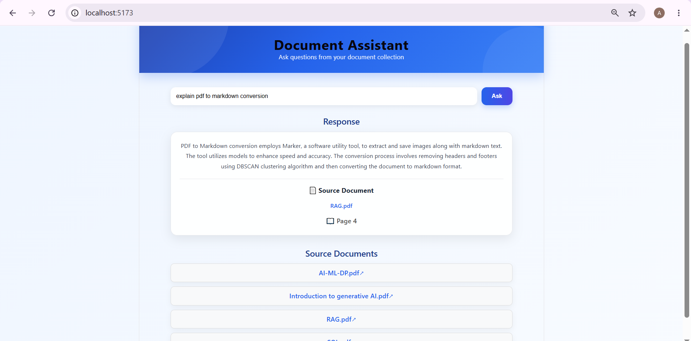
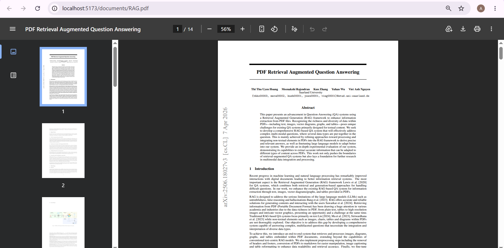

# 📄 AI Document Assistant

An AI-powered document question answering application built with **React**, **FastAPI**, **LangChain**, **ChromaDB**, **Hugging Face Embeddings**, and **Groq Llama 3.3**. Users can ask questions from PDF documents and receive accurate answers with the source document and page number.

## 🚀 Features
- 📚 Ask questions from multiple PDF documents
- 🤖 AI-powered answers using Groq Llama 3.3
- 🔍 Semantic search with ChromaDB
- 🧠 Hugging Face Sentence Transformer embeddings
- 📄 Displays the source PDF
- 📖 Shows the page number
- 🔗 Clickable source document links
- ⚡ FastAPI backend
- 🎨 React + Vite frontend

## 🛠 Tech Stack

**Frontend**
- React
- Vite
- CSS

**Backend**
- FastAPI
- LangChain
- ChromaDB
- Hugging Face Embeddings
- Groq API

## 📂 Project Structure

```text
AI-Document-Assistant/
├── backend/
├── frontend/
├── screenshots/
└── README.md
```

## 📸 Screenshots

### Home Page


### AI Generated Answer


### Source Document


### Opened PDF


## ⚙️ Installation

### Clone Repository

```bash
git clone https://github.com/Ayeshasiddiqahk7/AI-Document-Assistant.git
cd AI-Document-Assistant
```

### Backend Setup

```bash
cd backend
python -m venv venv
venv\Scripts\activate
pip install -r requirements.txt
```

Create a `.env` file:

```env
GROQ_API_KEY=your_groq_api_key
```

### Add PDF Documents

Place PDFs inside:

```text
backend/documents/
```

Create the vector database:

```bash
python ingest.py
```

### Start Backend

```bash
uvicorn app:app --reload
```

Backend:

```text
http://127.0.0.1:8000
```

### Start Frontend

```bash
cd frontend
npm install
npm run dev
```

Frontend:

```text
http://localhost:5173
```

## 💡 How It Works

1. Load PDF documents.
2. Split documents into chunks.
3. Generate embeddings.
4. Store vectors in ChromaDB.
5. Retrieve relevant chunks.
6. Generate answers using Groq Llama 3.3.
7. Display the answer, source PDF, and page number.

## 🌟 Example

**Question**

> What is SQL?

**Answer**

> SQL (Structured Query Language) is used to manage and manipulate relational databases.

**Source**

```
📄 SQL.pdf
📖 Page 1
```

## 🔮 Future Enhancements

- 🌙 Dark Mode
- 📤 Upload PDFs from the UI
- 💬 Chat History
- 📑 Multiple Source Documents
- 🎯 Highlight relevant text in PDFs
- ☁️ Deploy using Render and Vercel

GitHub: https://github.com/Ayeshasiddiqahk7

